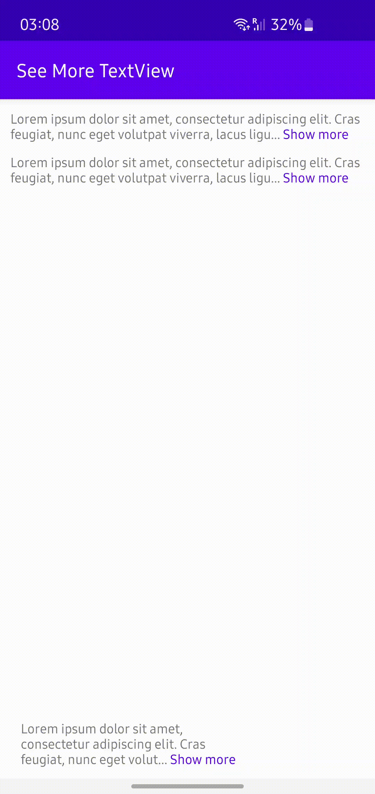

# SeeMoreTextView

An expandable text view with animation



## Add dependency
This libary is released on Jitpack.

1. Add Jitpack repository to your build file.

Add in your root build.gradle at the end of repositories
```
allprojects {
    repositories {
        ...
        maven { url 'https://jitpack.io' }
    }
}
```

2. Add the dependency
```
implementation 'com.github.himanshu-matharu:SeeMoreTextView:1.0.1'
```

## How to Use
Use the SeeMoreTextView just as you would use any other TextView.

```xml
<com.himanshumatharu.seemoretextview.SeeMoreTextView
        android:layout_width="match_parent"
        android:layout_height="wrap_content"
        android:text="@string/lorem_ipsum"
        app:layout_constraintTop_toTopOf="parent"
        android:maxLines="3"
        android:textSize="14sp"
        android:id="@+id/t1"
        android:layout_margin="10dp"
        app:clickableTextColor="?colorPrimary"/>
```

## Attributes
The SeeMoreTextView has the following attributes

| Attribute            |Format| Description | Default |
| -------------|------------- |------------|-----------|
| showTrimExpandedText      | boolean | Show a clickable span with the ellipsis to toggle textView state | true |
| viewExpandedText     | string | Text to show with ellipsis in expanded state | Show less |
| viewCollapsedText     | string  | Text to show with ellipsis in collapsed state | Show more |
| clickableTextColor       | color  | Color of clickable span with the ellipsis | #c0c0c0 |
| trimMode | enum | Choose trimModeLine to limit text using number of lines in collapsed state or trimModeLength to limit using number of characters | trimModeLine |
| trimLines  | dimension  | Number of lines allowed in collapsed state of textView | 2 |
| trimLength       | string | Number of characters allowed in collapsed state of textView | 105 |

## LICENSE
This project is licensed and distributed under the Apache License Version 2.0. See the <a href="https://github.com/himanshu-matharu/SeeMoreTextView/blob/master/LICENSE">LICENSE</a> file for more details.

## Acknowledgements
This library was based on https://github.com/bravoborja/ReadMoreTextView . This project involved addition of the expand and collapse animation.
